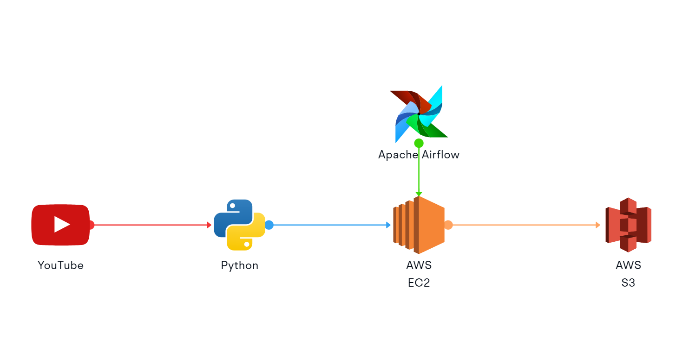

# YouTube ETL Pipeline | Data Engineering Project

## Introduction
This project demonstrates an ETL (Extract, Transform, Load) pipeline that extracts data from YouTube using Python, runs the script using Airflow on Amazon EC2, and loads the data into AWS S3.

## Project Overview
The primary goal of this project is to extract data from a YouTube channel, process it, and store it in AWS S3. This pipeline automates the extraction of channel statistics and video details, and schedules the process using Airflow on an EC2 instance.

## Architecture

## Technologies Used
- Python: For writing the ETL script.
- Airflow: For scheduling and running the ETL script.
- Amazon EC2: For hosting the Airflow instance.
- AWS S3: For storing the extracted data.
- Pandas: For data manipulation.
- Google API Client: For interacting with the YouTube Data API.

## YouTube ETL Pipeline Script
[YouTube ETL Script](Youtube_ETL.py)

[YouTube ETL DAG Script](youtube_dag.py)

## Conclusion
This project showcases an automated ETL pipeline for extracting and processing YouTube data, scheduled and managed by Airflow on an EC2 instance, with data storage in AWS S3. This setup can be extended to include more data sources and processing steps as needed.
